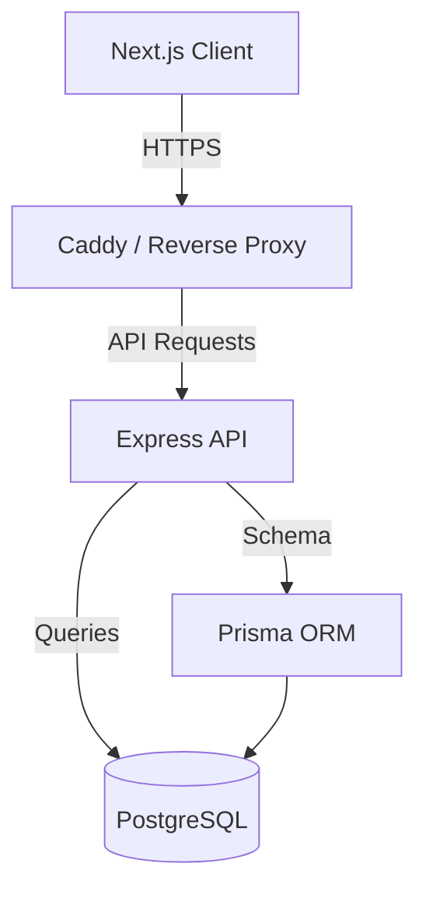

# HelpDesk Pro System Architecture

This document provides an atomic-level breakdown of the HelpDesk Pro architecture, covering workflows, security, RBAC, error handling, and core pipelines.

## 🏗️ High-Level Overview

HelpDesk Pro is a full-stack ticket management system built with a modular and scalable approach. It follows a client-server architecture with a clear separation of concerns between the frontend (Next.js), backend (Express), and database (PostgreSQL via Prisma).



---

## 🔐 Security Architecture

Security is baked into the system at multiple layers:

### 1. Authentication (AuthN)
- **Mechanism**: JWT (JSON Web Tokens) with a dual-token system (Access + Refresh).
- **Storage**: Access tokens are delivered via `httpOnly`, `secure`, and `sameSite: lax` cookies to prevent XSS.
- **Verification**: `authMiddleware` validates tokens for every protected route.

### 2. Authorization (AuthZ) & RBAC
- **Granular Permissions**: Permissions are defined at the role level in the database (e.g., `tickets:create`, `users:*`).
- **Dynamic Checking**: The `requirePermission` middleware checks for specific permission strings or wildcards during request processing.
- **Hierarchy Support**: Wildcards (`*`) allow for flexible permission management (e.g., `tickets:*` grants all ticket-related permissions).

### 3. Data Protection
- **SQL Injection**: Prevented by the Prisma ORM which uses parameterized queries.
- **XSS Prevention**: React automatically escapes content. `helmet` middleware is used on the backend to set secure HTTP headers.
- **CORS**: Strictly configured to only allow requests from the authorized frontend origin.

---

## 🚦 Request Pipeline & Workflow

### 1. General API Workflow
Each incoming request follows a standardized pipeline:
1.  **Middleware Chain**: CORS -> Helmet -> Body Parser -> Cookie Parser -> Logger.
2.  **Authentication**: `authMiddleware` extracts and validates the JWT.
3.  **Authorization**: `requirePermission` (if applicable) verifies user permissions.
4.  **Validation**: Zod schemas validate the request body and query parameters.
5.  **Business Logic**: The route handler processes the request using Prisma.
6.  **Response**: Normalized JSON response (Success/Error).

### 2. Ticket Lifecycle Workflow
The core workflow of the system centers around the ticket lifecycle:
1.  **Creation**: A customer creates a ticket. A unique `ticketNumber` is generated.
2.  **Assignment**: Tickets are assigned either automatically (based on department) or manually by an admin/manager.
3.  **Communication**: Customers and agents exchange comments. Internal comments are visible only to agents/admins.
4.  **SLA Tracking**: Each priority level has an associated SLA policy (Response/Resolution time) tracked via `responseDueAt` and `resolutionDueAt`.
5.  **Resolution**: An agent marks the ticket as resolved.
6.  **Closure**: The ticket is closed (final state).

---

## 🛠️ RBAC System

Roles and permissions are defined in `prisma/seed.ts` and stored as JSON in the database.

| Role | Core Permissions | Use Case |
| :--- | :--- | :--- |
| **SUPER_ADMIN** | `*` | Complete system control |
| **ADMIN** | `users:*`, `tickets:*`, `departments:*`, `kb:*` | Organization management |
| **MANAGER** | `tickets:*`, `kb:*`, departmental read access | Team oversight |
| **AGENT** | `tickets:read`, `tickets:update`, `tickets:comment`, `kb:read` | Ticket resolution |
| **CUSTOMER** | `tickets:create`, `tickets:read:own`, `kb:read:public` | Support requests |

---

## ❌ Error Handling Strategy

Standardized error handling ensures a predictable API surface and better debugging.

### 1. Response Format
All errors return a consistent JSON structure:
```json
{
  "success": false,
  "message": "Human-readable error description",
  "code": "ERROR_CODE_STRING",
  "statusCode": 400,
  "errors": [] // Optional validation details
}
```

### 2. Global Error Handler
The backend uses a central error-handling middleware in `backend/src/index.js` to catch:
-   **Multer Errors**: File size limits, invalid types.
-   **Prisma Errors**: Resource not found (`P2025`), Unique constraint violations (`P2002`).
-   **Validation Errors**: Automatically formatted from Zod issues.
-   **Generic Fallback**: Ensures no raw stack traces are leaked in production.

---

## 📁 Core Pipelines

### Data Pipeline (Prisma)
-   **Schema First**: All data models are defined in `schema.prisma`.
-   **Migrations**: Managed via `npx prisma migrate dev`.
-   **Seeding**: `prisma/seed.ts` acts as the bootstrap pipeline for roles, departments, and initial administrative users.

### File Processing
-   **Storage**: Files are currently stored locally in `backend/uploads`.
-   **Limits**: 10MB per file, max 5 files per ticket/comment.
-   **Validation**: Mime-type and size validation in the `attachments` route.
